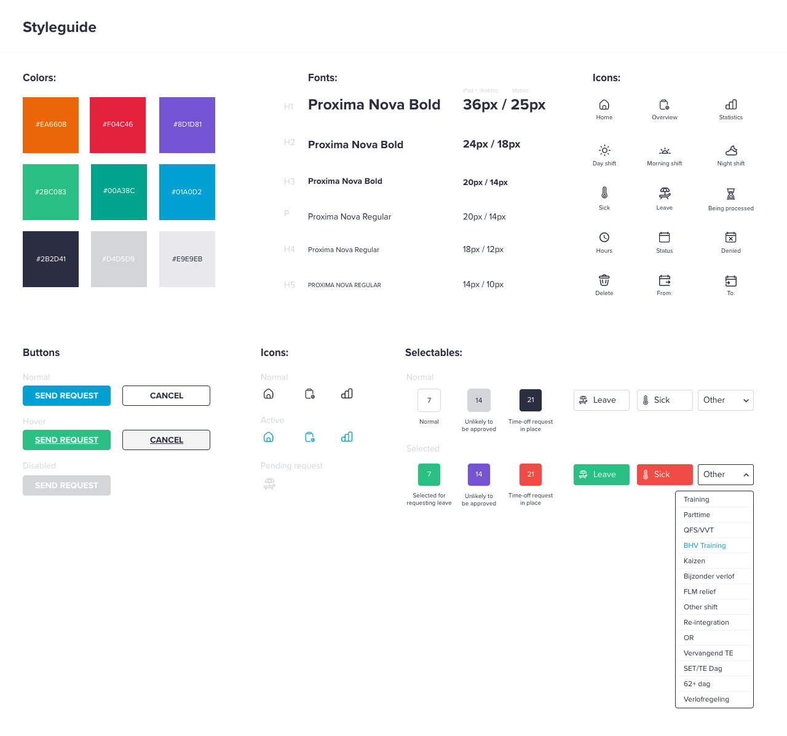

# PepsiCo Time Off Management System

A modern, responsive web application for managing employee time-off requests and schedules at PepsiCo. Built with HTML5, CSS3, JavaScript, and Tailwind CSS.



## 🚀 Features

### 🔐 Authentication
- **Secure Login System** - Username and password authentication with password visibility toggle
- **Session Management** - Persistent login state using localStorage

### 📅 Schedule Management
- **Interactive Calendar View** - Monthly calendar with navigation controls
- **Visual Schedule Indicators** - Color-coded icons for different shift types and weather conditions
- **Shift Types Support**:
  - Day Shift
  - Morning Shift  
  - Night Shift
  - Leave/Sick Days

### 📝 Leave Request System
- **Multiple Leave Types**:
  - Regular Leave
  - Sick Leave
  - Emergency Leave
- **Date Range Selection** - Interactive calendar for selecting start and end dates
- **Request Status Tracking** - Pending, Approved, and Denied status indicators

### 📊 Overview Dashboard
- **Request History** - View all submitted time-off requests
- **Status Overview** - Quick view of pending, approved, and denied requests
- **Calendar Integration** - Monthly view with leave periods highlighted

### 🔔 Notifications
- **Real-time Notifications** - Updates on request status changes
- **Notification History** - Complete log of all notifications
- **Visual Indicators** - Badge notifications in navigation

### 👤 User Profile
- **Profile Management** - User profile dropdown with settings
- **Settings Access** - Quick access to user preferences
- **Logout Functionality** - Secure session termination

## 🛠️ Technology Stack

- **Frontend**: HTML5, CSS3, JavaScript (ES6+)
- **Styling**: Tailwind CSS v3.x
- **Fonts**: Proxima Nova (custom font family)
- **Icons**: Custom SVG icon set
- **Build Tool**: Tailwind CSS CLI

## 📁 Project Structure

```
pepsico-time-off/
├── assets/
│   ├── Icons/                 # SVG icons for UI elements
│   ├── login-illustration.png # Login page illustration
│   ├── preview.png           # Application preview image
│   └── fonts/                # Custom font files
├── css/
│   └── index.css             # Main stylesheet with Tailwind
├── js/
│   ├── index.js              # Login page functionality
│   ├── overview.js           # Dashboard functionality
│   ├── schedule.js           # Calendar and schedule logic
│   ├── send-request.js       # Leave request form logic
│   └── notification.js       # Notification system
├── public/
│   └── favicon.ico           # Application favicon
├── index.html                # Login page
├── overview.html             # Dashboard/Overview page
├── schedule.html             # Schedule calendar page
├── sendrequest.html          # Leave request form
├── notification.html         # Notifications page
├── tailwind.config.js        # Tailwind CSS configuration
└── README.md                 # Project documentation
```

## 🚀 Getting Started

### Prerequisites

- Modern web browser (Chrome, Firefox, Safari, Edge)
- Local web server (optional, for development)

### Installation

1. **Clone the repository**
   ```bash
   git clone <repository-url>
   cd pepsico-time-off
   ```

2. **Install Tailwind CSS** (for development)
   ```bash
   npm install -D tailwindcss
   npx tailwindcss init
   ```

3. **Build CSS** (if making style changes)
   ```bash
   npx tailwindcss -i ./css/index.css -o ./css/output.css --watch
   ```

4. **Open the application**
   - Open `index.html` in your web browser
   - Or serve using a local web server:
     ```bash
     # Using Python
     python -m http.server 3000
     
     # Using Node.js
     npx serve . 3000
     ```

### Quick Start

1. Open `index.html` in your browser
2. Enter any username and password to login (demo mode)
3. Navigate through the application using the top navigation bar
4. Explore features like creating leave requests, viewing schedules, and checking notifications

## 🎨 Design System

### Typography
- **Primary Font**: Proxima Nova
- **Fallback**: Sans-serif system fonts

### Icons
- Custom SVG icon set for consistent visual language
- Icons for navigation, status indicators, and actions

## 📱 Responsive Design

The application is fully responsive and optimized for:
- **Desktop** (1024px and above)
- **Tablet** (768px - 1023px)
- **Mobile** (320px - 767px)

## 🔧 Configuration

### Tailwind CSS Configuration

The application uses a custom Tailwind configuration with:
- Extended color palette matching PepsiCo brand colors
- Custom font family (Proxima Nova)
- Responsive breakpoints
- Custom utility classes

### Customization

To customize the application:

1. **Colors**: Modify `tailwind.config.js` and CSS custom properties in `css/index.css`
2. **Fonts**: Update font references in the configuration and CSS files
3. **Icons**: Replace SVG files in the `assets/Icons/` directory
4. **Layout**: Modify HTML templates and corresponding JavaScript files

## 🤝 Contributing

1. Fork the repository
2. Create a feature branch (`git checkout -b feature/amazing-feature`)
3. Commit your changes (`git commit -m 'Add some amazing feature'`)
4. Push to the branch (`git push origin feature/amazing-feature`)
5. Open a Pull Request

## 📄 License

This project is proprietary software developed for PepsiCo internal use.

## 📞 Support

For support and questions, please contact the development team or create an issue in the project repository.

---

**Built with ❤️ for PepsiCo employees**